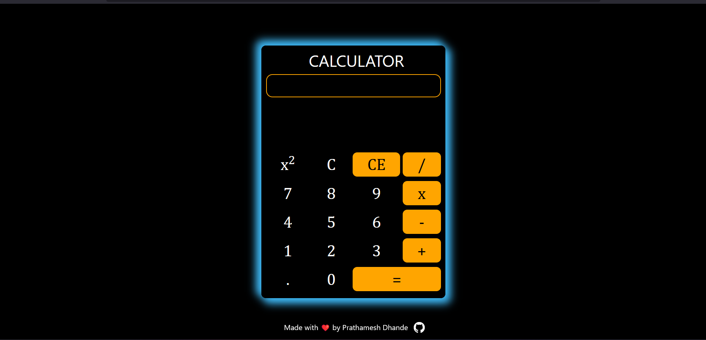
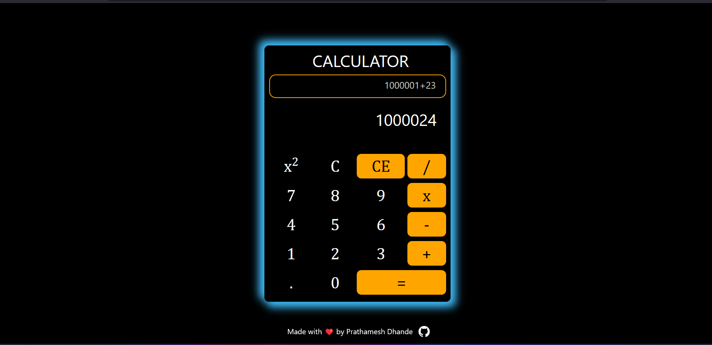

# Simple Calculator Using Javascript

This Project is the part of the [Web-Development-Tutorial](https://github.com/PrathameshDhande22/Web-Development-Tutorial) Repository

### Demo : https://prathameshdhande22.github.io/Simple-Calculator-JS/

This is a simple calculator built with HTML, CSS, JavaScript, and Bootstrap. It allows users to perform basic arithmetic operations like addition, subtraction, multiplication, division, and square. In addition, it also supports input from the keyboard, making it easier and faster to perform calculations.

## Features : 
- Simple and intuitive user interface
- Keyboard input support
- Addition, subtraction, multiplication, division, and square operations
- Error handling for invalid inputs
- Responsive design using Bootstrap

## How to Use ?
1. Clone this repository to your local machine.
2. Open the index.html file in your web browser.
3. Click the buttons on the calculator interface or use your keyboard to input numbers and perform operations.
4. The result of the calculation will be displayed in the calculator interface.

## Technologies Used : 
- HTML
- CSS
- JavaScript
- Bootstrap

## Screenshots : 
1. Calculator Interface

2. Calculator Screenshot while performing Operations

## Credits
This project was created by [Prathamesh Dhande](https://www.github.com/prathameshdhande22). Feel free to use and modify this code for your own purposes. If you have any questions or suggestions, please feel free to contact me.

## Author : Prathamesh Dhande